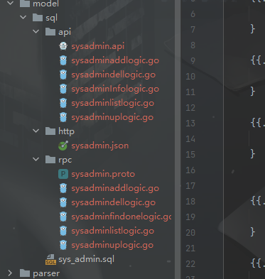

#### 主要用于go-zero代码生成:
NAME:
gozc - go-zero CRUD生成器

USAGE:
gozc.exe [global options] command [command options] [arguments...]

VERSION:
1.0

COMMANDS:
run      Print worker info
help, h  Shows a list of commands or help for one command

GLOBAL OPTIONS:
--help, -h     show help (default: false)
--version, -v  print the version (default: false)

#### 如何使用 

首先需配置环境变量 GOZC_PATH 指向项目中tpl模板文件

首页注释为程序入口方式
//os.Args = append(os.Args, "run", "--m=admin", "--sql=E:\\Gopath\\src\\gozc\\model\\sql\\sys_admin.sql")

如何使用
gozc run  --m=服务名称  --sql=sql文件路径  可写运行目录加文件./ 或者.\

生成后目录为图

CRUD 个人架构主观性比较强  这边建议自行修改适配现有项目

api为API文件 为api  go-zero的api文件 和对应sql的  CRUD方法

http为 OpenAPI/Swagger 文件用于导入 apifox 或者其他软件

rpc为rpc文件 为rpc  go-zero的 rcp文件 和对应的sql的 CRUD方法  编写包应用
"github.com/Masterminds/squirrel"
"github.com/zeromicro/go-zero/core/stores/builder"
"github.com/zeromicro/go-zero/core/stores/cache"
"github.com/zeromicro/go-zero/core/stores/sqlc"
"github.com/zeromicro/go-zero/core/stores/sqlx"

用于list方法生成  CRUD内容大部分偏向主观  请自行选择或者修改

工具类编写的稍微有点快没那么规范，所以重复的地方可能稍微有点多，功能写的不是那么通用。毕竟我比较笨

如果感觉对你有帮助记得给一个start 这个项目肯定会提高你的生产力。

ps:但是发明了一个更好的工具效率提高了，但是对项目是否有帮助和对人的影响请自行考虑。（有利有弊）

